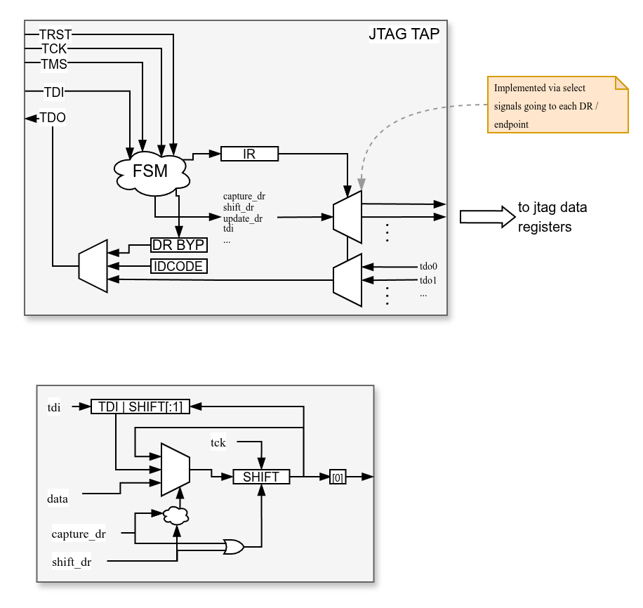
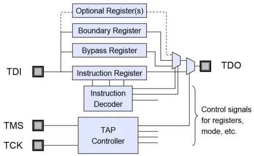

<!--  -->
##

Goal: provide low-effort access to design components through a standardized interface.

While there are many other approaches that can also use JTAG, the main intention is to use OpenOCD tcl scripting.

## 

- [x] TAP FSM
- [ ] TAP with variable amount of user registers
    - [x] TAP implementation with FSM and IR, BYPASS, IDCODE register and TDO mux
    - [x] simple testbench
    - [ ] self testing testbench
- [x] JTAG register with shift and hold register
- [x] JTAG sync register from TCK to faster system clock
    - [ ] investigate clock crossing:
        vivado complains about single destination register but bluespec crossing module uses handshaking with multiple destination registers in a CDC control path
- [x] JTAG bus adapter with CDC (proof-of-concept)
- [x] JTAG system builder using bluespec contexts
- [x] JTAG tesbench drivers
    - [x] Clock adapters for correct bluesim simulation
        - [x] TCK driven from a wire 
        - [x] TDO updates at falling TCK
    - [x] StmtFSM functions for driving JTAG wires
- [ ] JTAG Xilinx
    - [x] BSCANE2 primitive integration with custom JTAG registers
    - [ ] BSCANE2 tunneling
        - [ ] BSCANE2 to JTAG conversion like https://github.com/eugene-tarassov/vivado-risc-v/blob/master/vhdl-wrapper/src/net/largest/riscv/vhdl/bscan2jtag.vhdl
        - [ ] BSCANE2 tunneling compliant with OpenOCD
- [ ] OpenOCD testing
    - [x] OpenOCD bluesim simulation
    - [x] OpenOCD verilog simulation
    - [x] OpenOCD FPGA test with BSCANE2
    - [ ] OpenOCD FPGA test of the custom TAP exposed on external device pins
- [ ] FPGA testing
    - [x] test simple JTAG register connected to BSCANE2
    - [x] test JTAG register with CDC connected to BSCANE2
    - [ ] test JTAG bus adapter with CDC connected to BSCANE2

## Running

## Examples

The file `hdl/src/FPGATop.bsv` contains a few designs that demonstrate the use of some custom JTAG modules on a Xilinx FPGA.

#### `mkFPGATestSimplest`
Exposes 32 bit constant register via BSCANE2 user 3 and blinks LEDs with some constant divider.

#### `mkFPGATestSimple`
Has JTAG configurable LEDs. The control register with a 32 bit divider and a configurable amount of LED enables is exposed via user register 3 on a BSCANE2 instance.

#### `mkFPGATestBusTop`
TODO

## Modules

### `mkJTAG_TAP_FSM`
Implementation of IEEE1149.1 TAP controller FSM.
Has a single input alongside the bluespec default clock and reset:
```VHDL
method Action tms((*port="TMS"*) Bit#(1) t);
```
Outputs some control signals that indicate IR/DR update/shift/capture states.
```verilog
interface JTAG_FSM_Ctrl_ifc;
    method Bool update_dr();
    method Bool shift_dr();
    method Bool capture_dr();
    method Bool update_ir();
    method Bool shift_ir();
    method Bool capture_ir();
endinterface
```
### `mkJTAG_TAP_Controller`
Combines TAP FSM with instruction register (IR), IDCODE register and bypass register. Also provides a combinational instruction decoder for selecting where to route the FSM control signals as well as a
TDO mux to output data from the correct data register.

The TAP offers a few configuration options for customization which are supplied via a module parameter of the type `JTAG_TAP_Config_t#(n, w)` where `n` is the number of custom instructions and `w` the bit-width of the IR.
```verilog
typedef struct {
    Bit#(11) idcode_man;
    Bit#(16) idcode_part;
    Bit#(4) idcode_ver;
    Bool reg_tdo;
    Vector#(n, JTAGInstruction_t#(w)) instrs;
    JTAGInstruction_t#(w) instr_idcode;
    Bool reset_idcode_not_bypass;
    Bool debug;
} JTAG_TAP_Config_t#(numeric type n, numeric type w) deriving(FShow, Eq, Bits);
```
Another module parameter are the TDO outputs of the connected JTAG system components:
```verilog    
Vector#(n, ReadOnly#(Bit#(1))) vTDO_up
```
The instruction codes supplied in the TAP configuration get mapped to these interfaces. 

The general structure of the TAP controller is shown in the following image:



Image source: https://semiengineering.com/knowledge_centers/standards-laws/standards/ieee-1149/.
There is no boundary register at this point and the "optional" registers are not located inside the TAP controller but connected to it via the TAP control interface.

Besides the control input TMS, there is the data input TDI, data output TDO as well as a forwarded TDI output port and `n` JTAG upstream control interfaces:
```verilog
interface JTAG_TAP_Controller_ifc#(numeric type n);

    (* prefix="" *) method Action tms((*port="TMS"*) Bit#(1) t);
    (* prefix="" *) method Action tdi((*port="TDI"*) Bit#(1) t);

    (* prefix="", result="TDO" *) method Bit#(1) tdo();

    method Bit#(1) int_tdi();
    interface JTAG_Ctrl_Up_ifc#(n) tap_ctrl;

endinterface
```

### `mkJTAGReg`, `mkJTAGRegR`, `mkJTAGBypass`

A raw JTAG register is the primitive endpoint used by the higher-level JTAG system helpers. Data can be shifted into the JTAG register and can also be shifted out again. Contained within a JTAG register are the hold register `rHR` and the shift register `rSR`.
`mkJTAGReg` is a special version of `mkJTAGRegR` that does not support a reset value, meaning the value stored inside the hold register after system reset is undefined. This is cheaper and might make sense whenever the JTAG register would be written initially anyways.

Matching the TAP controller upstream control interface, the JTAG registers have a downstream control interface alongside the shift input TDI and output TDO as well as a pair of additional output signals `reg_o` (carrying data) and `wr_o` indicating valid output.
```verilog
interface JTAG_Reg_ifc#(type t);

    method t reg_o();
    method Bool wr_o();
    
    method Bit#(1) tdo();
    method Action tdi(Bit#(1) t);
    interface JTAG_Ctrl_Dn_ifc ctrl;

endinterface
```
The shift and control interface components are usually connected by `jtag_endpoint` or one of the `jtag_reg_*` helpers. The raw `reg_o`/`wr_o` pair is still useful inside custom endpoints, but most device-facing code should consume the guarded `updated()` access method instead.

With the type parameter `t`, an arbitrary storage type from the `Bits` typeclass can be used. The behaviour of the JTAG register matches the specification:
The module parameter `t reg_i` is used during the capture phase. JTAG registers only act when they're selected by the TAP controller (or any other module providing an upstream JTAG control interface).

- upon `shift=1`, the shift register is shifted *right* by one bit and TDI is shifted in on the MSB
- upon `capture=1`, the shift register is updated with the value of `reg_i` (this can be dynamic!)
- upon `update=1`, the hold register is updated with the value of the shift register
    - `wr_o` will read 1 in the next cycle
    - `reg_o` will provide the new value of the hold register on the next cycle


Because of some bluespec limitations, the bypass register with width 1 is its own module `mkJTAGBypass`.

### `jtag_reg_*`, `jtag_sync_reg_*`, `jtag_endpoint`

The JTAG system API owns the common register wiring and exposes a small device-facing access interface:
```verilog
interface JTAGRegAccess_ifc#(type t);
    method ActionValue#(t) updated();
endinterface
```
The `updated()` method is guarded by the JTAG update pulse and returns the updated value in that cycle. A rule can therefore consume a JTAG write with:
```verilog
rule consume_update;
    let value <- reg_access.updated();
    ...
endrule
```
The normal constructors are:

- `jtag_reg_ro(reg_i, instr)`: expose a value for JTAG reads; JTAG writes have no device-facing effect
- `jtag_reg_wo(instr)`: accept JTAG writes and expose them via `updated()`
- `jtag_reg_rw(device_reg, instr)`: expose a device `Reg#(t)` for JTAG reads, update it on JTAG writes, and provide the same write pulse via `updated()`
- `jtag_reg_pulse(instr)`: expose a one-bit command register as a guarded `pulse()` action

The `jtag_sync_reg_*` variants use the existing TCK-to-system-clock synchronizing register primitive and expose the same device-facing API in the system clock domain. `jtag_endpoint(jtag_reg, instr)` is the escape hatch for custom endpoints that need direct access to the raw `JTAG_Reg_ifc` internally.

### `mkJTAG_BusAdapter`

One useful application of custom JTAG systems is gaining access to the system bus of a design. Depending on the system architecture this allows easy manipulation of components, bus monitoring or other functionality typically reserved to soft cpus or other external bus accessor mechanisms.

To facilitate a bus access via JTAG, there needs to be some kind of unified data structure for bus requests and bus responses that can be communicated through a JTAG register. Since this module is intended to serve as an example, this is kept simple here:
```verilog
typedef struct {
    Bool ignore; //we need to be able to perform a DRSCAN without issuing another request
    Bool error;
    Bool resp_valid;
    Bool write_not_read;
    Bit#(aw) addr;
    Bit#(dw) data;
} JTAG_BusControl_Simple#(numeric type aw, numeric type dw) deriving(Eq, Bits, FShow);
```
Data and address width are configurable, the ignore bit is used to read out the bus response without triggering another bus request.

The typical flow for accessing the system bus via JTAG is as follows:

1. Write a read/write request to the JTAG register
2. Wait until bus response arrived (usually the bus is significantly faster than TCK)
3. Read the bus response from the JTAG register

To allow for a faster bus, there are FIFO synchronizers on the bus-facing interface. The bus adapter is itself a JTAG system component; `mkJTAG_BusAdapter(instr, bus_clk, bus_rst)` owns its internal JTAG register and exports only the bus client interface.

### `build_jtag_system`

Helper module that allows easier creation of whole JTAG systems as shown in the figure above. It collects all JTAG endpoints, derives the TAP instruction vector from those endpoints, and connects their TDO/TDI/control paths to the TAP controller.

A JTAG system has a special interface:

- on one side the typical JTAG pins 
- on the other side the "device"-facing, internal interface that allows interacting with the JTAG components instantiated inside the JTAG system

The internal interface is entirely implementation specific and can be of arbitrary complexity. This is best shown with an example, suppose we want to have a JTAG register at instruction `'h02` with the reset value `'hC0DEAFFE` and a bus adapter (see above) at instruction `'hDE`.

The device-facing interface lets us consume JTAG register updates and connect the bus:
```verilog
interface MyJTAGSystem_ifc;
    method ActionValue#(Bit#(32)) user_reg0();
    interface Client#(BusRequest#(32, 32), BusResponse#(32)) bus_client;
endinterface
```
Defining the JTAG system is simple:
```verilog
module [JTAGSystem#(2, `IR_WIDTH)] myJTAGSystem#(Clock bus_clk, Reset bus_rst)(MyJTAGSystem_ifc);

    JTAG_TAP_Config_t#(2, `IR_WIDTH) jtag_config = JTAG_TAP_Config_t {
        idcode_man: 'b00000010111,
        idcode_part: 'h04,
        idcode_ver: 0,
        reg_tdo: True, //tdo is registered (on falling tck) in real applications
        instrs: replicate(0), //derived from the registered endpoints below
        debug: True, //debug prints
        instr_idcode: 0,
        reset_idcode_not_bypass: True //reset to idcode not bypass
    };

    Reg#(Bit#(32)) reg0_value <- mkReg('hC0DEAFFE);
    JTAGRegAccess_ifc#(Bit#(32)) reg0 <- jtag_reg_rw(reg0_value, 'h02);
    JTAG_BusAdapter_ifc#(32, 32) ifc <- mkJTAG_BusAdapter('hDE, bus_clk, bus_rst);

    set_tap_config(jtag_config);

    method user_reg0 = reg0.updated;

    interface bus_client = ifc.bus;
        
endmodule
```
Instantiating the custom JTAG system yields a synthesizable module:
```verilog
(* synthesize *)
module mkCustomJTAGSystem#(Clock tdo_clk, Reset tdo_rst, Clock bus_clk, Reset bus_rst)(JTAGSystem_ifc#(MyJTAGSystem_ifc));
    let jtag_sys <- build_jtag_system(myJTAGSystem(bus_clk, bus_rst), tdo_clk, tdo_rst);
    return jtag_sys;
endmodule
```
Now, `mkCustomJTAGSystem` provides the JTAG system interface and only has to be connected externally (JTAG pins) and internally (device-facing interface).


## Examples & Tests

### OpenOCD simulation `TestOOCD`

In `TestOOCD.bsv` the above JTAG system is built and connected to an OpenOCD simulation driver that creates a linux socket for OpenOCD to connect to. OpenOCD can then be used with the remote bitbang driver to connect to the simulation and issue JTAG commands. The OpenOCD configuration file is located here: `hdl/test/bluej.cfg`

OpenOCD output:
```bash
Open On-Chip Debugger 0.12.0+dev-ge09bb72da (2025-10-28-11:16)
Licensed under GNU GPL v2
For bug reports, read
        http://openocd.org/doc/doxygen/bugs.html
Info : Initializing remote_bitbang driver
Info : Connecting to unix socket /tmp/jtag.sock
Info : remote_bitbang driver initialized
Info : Note: The adapter "remote_bitbang" doesn't support configurable speed
Info : JTAG tap: bluej.tap tap/device found: 0x74e00081 (mfg: 0x040 (ProMos/Mosel Vitelic), part: 0x4e00, ver: 0x7)
Warn : gdb services need one or more targets defined
Info : Listening on port 6666 for tcl connections
Info : Listening on port 4444 for telnet connections
```

The OpenOCD configuration file only sets up the adapter and TAP. BlueJ-specific operations are implemented in `hdl/test/bluej_openocd.py` by composing ordinary OpenOCD `irscan`, `drscan`, and `runtest` commands.

Example where the BRAM connected to the bus adapter was preloaded with `0x34FAD707` at `0x8`:
```bash
python3 hdl/test/bluej_openocd.py --expect-idcode 0x474f --expect-data 0x34fad707
```
For longer scripts, keep OpenOCD running and connect to its Tcl port:
```python
from bluej_openocd import BlueJOpenOCD
from py_openocd import OpenOCDTclClient

with OpenOCDTclClient() as runner:
    jtag = BlueJOpenOCD(runner=runner)
    jtag.bus_write32(0x8, 0x12345678)
    data = jtag.bus_read32(0x8)
```
Bluespec simulation:
```
TAP: update IR to de
Selecting data register 2
[5606378] Got Bus request: BusRequest { write_not_read: False, addr: 'h00000008, data: 'h00000000 }
[5606380] BRAM response: 'h34fad707
```
