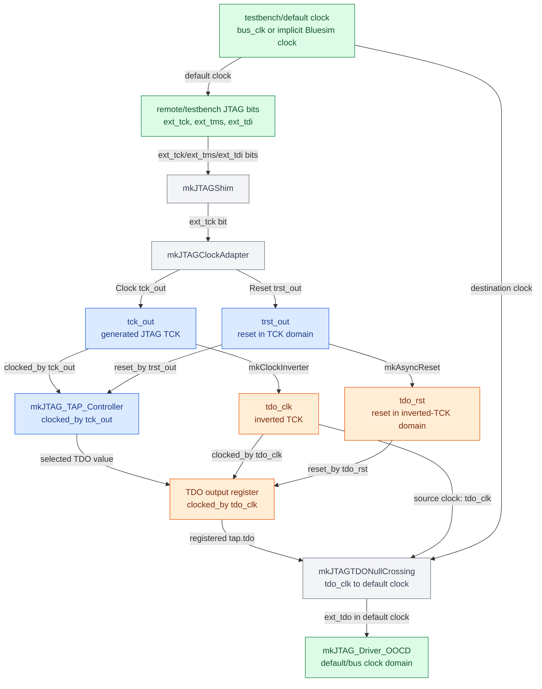

# JTAG Clocking and TDO Crossing

This note describes the clocking structure used by the BlueJ JTAG test and simulation infrastructure. It focuses on where clock-domain crossings are used, which crossings intentionally store data, and how the TDO path is arranged so both Bluespec testbenches and vanilla OpenOCD can observe correct JTAG timing.

## Design Goals

- Model JTAG TCK as a real Bluespec `Clock`, even when the stimulus source is a bit-level simulator or socket protocol.
- Run the TAP state machine and JTAG shift registers on rising TCK.
- Register external TDO on falling TCK when `reg_tdo=True`, matching normal JTAG timing expectations.
- Avoid adding a second JTAG-bit delay when a simulator driver reads an already registered TDO value.
- Keep the generic Bluespec shim useful for local test FSMs while providing a more direct TDO observation path for OpenOCD.

## Components

`mkJTAGClockAdapter` converts bit-level `ext_tck` and `ext_trst` inputs into:

- `tck_out`: the generated TAP clock.
- `trst_out`: reset in the `tck_out` domain.
- `tdo_clk`: inverted `tck_out`, used for falling-edge TDO registration.
- `tdo_rst`: reset in the `tdo_clk` domain.

`mkJTAGShim` connects ordinary Bluespec testbenches to that generated JTAG clocking structure. It accepts `ext_tck`, `ext_tms`, and `ext_tdi` in the default testbench clock domain and exposes `int_tms` and `int_tdi` in the generated TCK domain. It also has a registered TDO return path intended for BSV test FSMs that account for that extra delay.

`mkJTAG_TAP_Controller` runs in the `tck_out` domain. Its optional external TDO register, `rg_ext_tdo`, runs in the `tdo_clk` domain. With `reg_tdo=True`, `tap.tdo` is therefore updated on falling TCK.

`mkJTAGTDONullCrossing` is a lightweight observer for an already registered TAP TDO value. It is used by the OpenOCD test path so remote-bitbang reads see the TAP's falling-edge registered TDO without passing through the shim's extra registered TDO crossing.

`mkJTAG_Driver_OOCD` implements the remote-bitbang socket bridge. Its `JTAG_TDO_Delay#(n)` parameter delays socket responses by simulator cycles, not by extra JTAG shifts. In the current OpenOCD path, one response cycle is used so Verilog/VPI values settle before the socket reply is sent.

## Clock Hierarchy

In the diagram, green nodes are in the default/bus clock domain, blue nodes are in the generated `tck_out` domain, and orange nodes are in the inverted `tdo_clk` domain. Gray nodes are clock-domain adapters or crossings that span more than one domain.



## Crossing Inventory

| Signal/path | Mechanism | Storage | Purpose |
| --- | --- | --- | --- |
| `ext_tck` to `tck_out` | `mkUngatedClock` via `setClockValue` | clock generator state | Creates a real Bluespec clock from bit-level JTAG stimulus. |
| `ext_trst` to `trst_out` | `mkReset` driven by `trst_in` | reset generator state | Produces reset in the generated TCK domain. |
| `tck_out` to `tdo_clk` | `mkClockInverter` | clock primitive | Provides the falling-edge clock used for TDO updates. |
| `trst_out` to `tdo_rst` | `mkAsyncReset` into `tdo_clk` | reset synchronizer | Gives the falling-edge TDO register a reset in its own domain. |
| `ext_tms` to TAP `tms` | default-domain `Reg`, then `mkNullCrossingWire(tck_out, tms_in)` | one default-domain register | Makes TMS visible to the TAP FSM in the TCK domain. |
| `ext_tdi` to TAP `tdi` | `mkNullCrossingReg(tck_out, 0)` | crossing register | Makes TDI stable for TCK-domain shift rules. |
| TAP internal TDO sources to falling-edge mux | `mkNullCrossingWire(tdo_clk, ...)` | no extra register | Lets the falling-edge TDO mux observe TCK-domain shift-register outputs. |
| TAP external TDO output | `rg_ext_tdo` clocked by `tdo_clk` when `reg_tdo=True` | one falling-edge register | Implements spec-style TDO update timing. |
| `mkJTAGShim.int_tdo` to `mkJTAGShim.ext_tdo` | `mkNullCrossingReg(default_clk, 0, clocked_by tdo_clk)` | extra crossing register | Returns TDO to ordinary BSV test FSMs; the tests compensate for this delay. |
| OpenOCD TDO observation | `mkJTAGTDONullCrossing(tap.tdo, tdo_clk, tdo_rst)` | no extra JTAG-bit storage | Exposes already registered TAP TDO to remote-bitbang without double-registering it. |

## TAP Timing Model

The TAP FSM and JTAG data registers are clocked by `tck_out`.

- TAP state transitions occur on rising TCK.
- IR/DR capture, shift, and update rules are TCK-domain actions.
- A JTAG register's `tdo()` method exposes the shift-register LSB.
- The external TDO mux is evaluated in the inverted-TCK domain.
- With `reg_tdo=True`, `rg_ext_tdo` captures the selected TDO value on `tdo_clk`, which corresponds to falling TCK.

This matches the usual JTAG timing model: TDO changes after falling TCK and is stable before the following rising-edge sample.

## Testbench Paths

### BSV Test FSMs

The normal BSV tests use `mkJTAGShim` end to end:

```text
test FSM -> mkJTAGShim -> generated TCK/TMS/TDI -> TAP
TAP TDO -> mkJTAGShim.ext_tdo -> test FSM
```

This path includes the shim's registered TDO crossing. The testbench scan helpers therefore use an explicit TDO delay when sampling returned data.

### OpenOCD Remote-Bitbang

The OpenOCD test path uses the shim for TCK/TMS/TDI generation, but bypasses the shim's registered TDO return path:

```text
OpenOCD -> mkJTAG_Driver_OOCD -> mkJTAGShim -> generated TCK/TMS/TDI -> TAP
TAP registered TDO -> mkJTAGTDONullCrossing -> mkJTAG_Driver_OOCD -> OpenOCD
```

This keeps the TAP behavior spec-like while avoiding a second TDO register after the TAP. The socket bridge may delay the response by one simulator cycle for Verilog/VPI settling, but that delay does not shift the JTAG bit stream because remote-bitbang read commands block until the response byte is returned.

`hdl/test/bluej_openocd.py` uses this real OpenOCD path by default. Its explicit `--backend bitbang` mode is only a diagnostic tool for isolating socket, sampling, and TDO alignment issues without OpenOCD in the loop.

## Practical Rules

- Use `jtag_set_reg_tdo(True)` for TAPs that should behave like real JTAG hardware.
- Keep `mkJTAGShim` for local BSV tests that need generated TCK/reset and testbench-domain stimulus.
- Use `mkJTAGTDONullCrossing(tap.tdo, tdo_clk, tdo_rst)` for OpenOCD or other remote-bitbang style drivers.
- Do not blindly replace registered crossings with null crossings. A null crossing works only when the source value can be read by the crossing rule without depending on a method write in the same cycle.
- For unrelated system clocks, use real synchronizers such as `mkJTAG_Reg_Sync`, `mkSyncFIFOFromCC`, or `mkSyncFIFOToCC`. The TAP/TDO null crossings here rely on TCK and inverted TCK being generated from the same JTAG stimulus.
